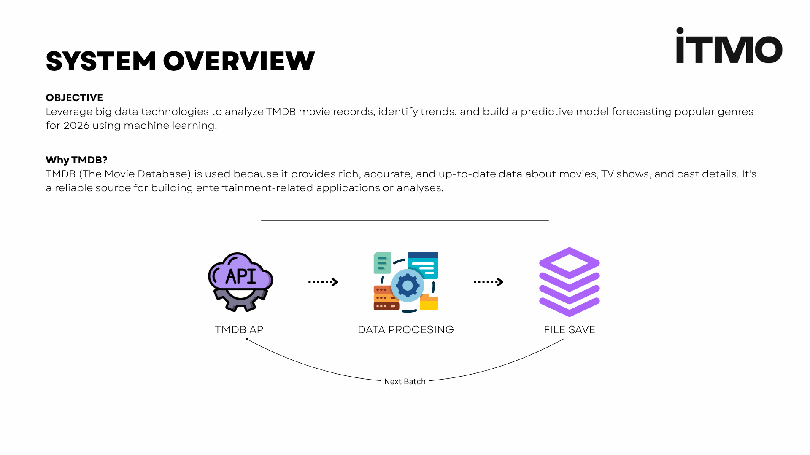
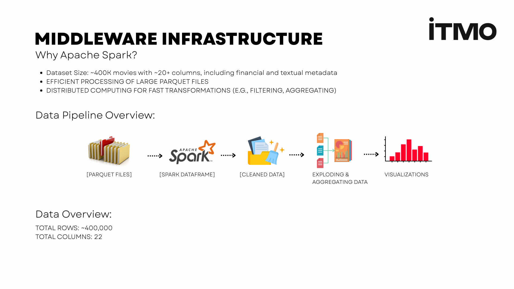
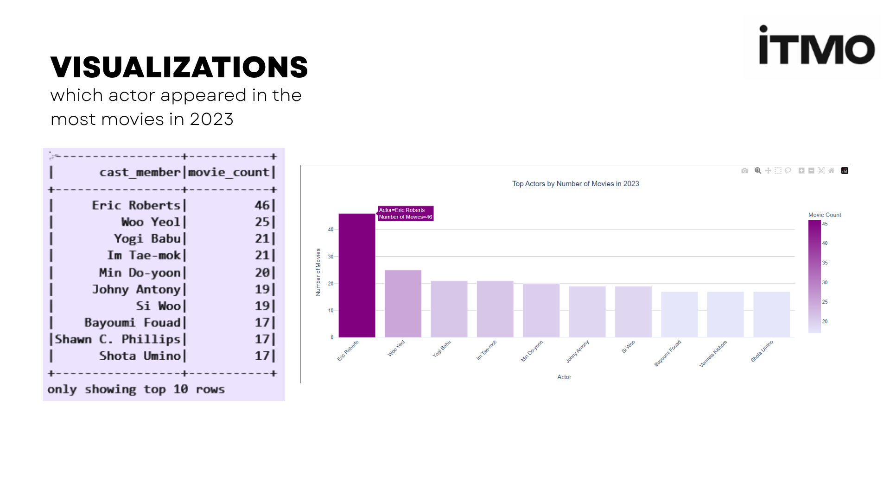
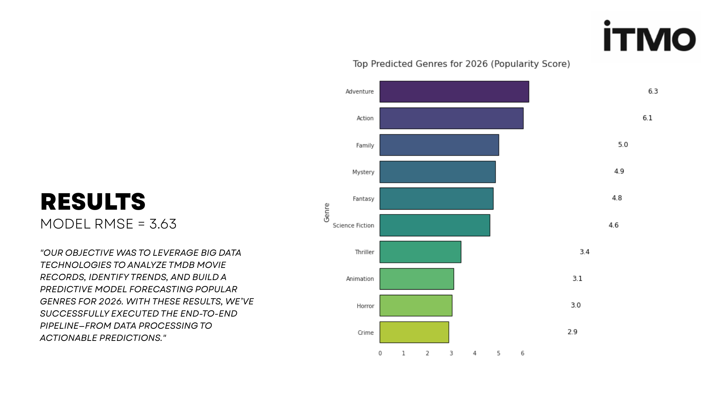

# TMDB Movie Database Analysis & Genre Popularity Prediction

> Leveraging big data tech (Apache Spark) to analyze 400k TMDB movie records and build a machine learning model forecasting popular genres for 2026.

This project, completed for the ITMO course "Big Data & Technologies," demonstrates an end-to-end big data pipeline. The primary objective was to leverage big data technologies to analyze over 400,000 movie records from The Movie Database (TMDB), identify trends, and build a predictive machine learning model to forecast popular movie genres for 2026.

## Technologies Used

* **Data Gathering:** Python, `requests`, `ratelimit`, `ThreadPoolExecutor` (concurrent.futures), `pandas`, `pyarrow` (for Parquet)
* **Data Processing & Analysis:** Apache Spark, PySpark SQL
* **Machine Learning:** PySpark MLlib (`StringIndexer`, `VectorAssembler`, `RandomForestRegressor`, `Pipeline`, `RegressionEvaluator`)
* **Visualization:** Matplotlib, Seaborn

## Project Pipeline

The project is built as a complete data pipeline, from raw API ingestion to final predictive insights.

1.  **ID Extraction:** A list of ~427,000 valid movie IDs was generated by downloading and filtering the TMDB daily export file (`BD_TMDB_extraction_ids.ipynb`).
2.  **Data Fetching:** A multi-threaded, rate-limited Python script (`BD_TMDB_Data.ipynb`) queried the TMDB API for the full details of all 427k IDs. This script features a robust checkpointing system (`checkpoint.json`) to resume after interruptions.
3.  **Data Storage:** Data was processed and saved in batches as `.parquet` files, which were then combined into a single ~400,000-record dataset: `full_tmdb_dataset.parquet`.
4.  **Spark Processing:** The full dataset was loaded into an Apache Spark DataFrame for large-scale, distributed cleaning, analysis (using `split` and `explode` on genres/cast), and feature engineering (`BD_TMDB_ApacheSpark.ipynb`).
5.  **Modeling & Prediction:** A Random Forest model was trained using Spark MLlib to predict genre popularity based on the year. This model was then used to forecast trends for 2026.

## Key Analytical Findings

The analysis using PySpark SQL revealed several key insights into the movie industry:

* **Top Genre:** **Drama** is the most common genre, with **145,119** entries.
* **Top Actor (2023):** **Eric Roberts** was the most prolific actor in 2023, appearing in **46** movies.
* **Top ROI Movies:** The films with the highest Return on Investment (with a budget > $100M) include **Titanic (1032% ROI)**, **Jurassic World (1014% ROI)**, and **Barbie (897% ROI)**.

## Machine Learning Model: 2026 Genre Prediction

The primary goal was to build a predictive model. A Random Forest Regressor was trained on genre and release year data to predict a normalized popularity score.

* **Model:** `RandomForestRegressor` (50 trees)
* **Evaluation (RMSE):** **3.63**

The model was then used to predict the top 10 most popular genres for 2026:

**Top 5 Predicted Genres for 2026:**
1.  Adventure
2.  Action
3.  Family
4.  Mystery
5.  Fantasy

## How to Run

This project is contained in three main notebooks:

1.  `BD_TMDB_extraction_ids.ipynb`: Run this first to generate the `All_IDs.csv` file (or use the one provided).
2.  `BD_TMDB_Data.ipynb`: Run this second. It requires a TMDB API key and will take several hours to fetch all 400k+ records. It creates the final `full_tmdb_dataset.parquet`.
3.  `BD_TMDB_ApacheSpark.ipynb`: Run this last. This notebook must be run in a Spark environment. It loads the `.parquet` file and performs all the analysis, visualization, and ML model training.
